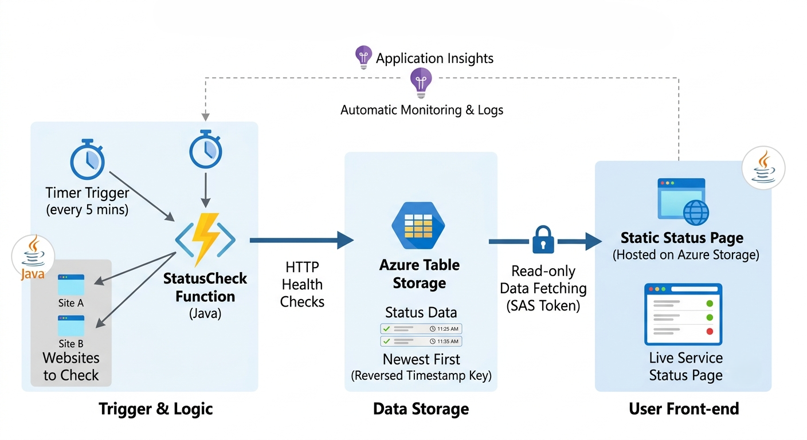
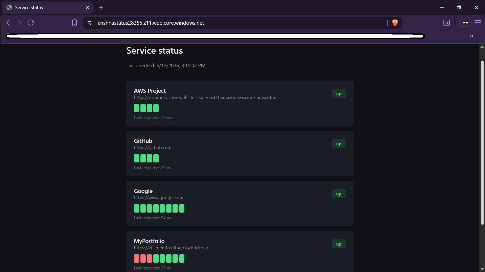
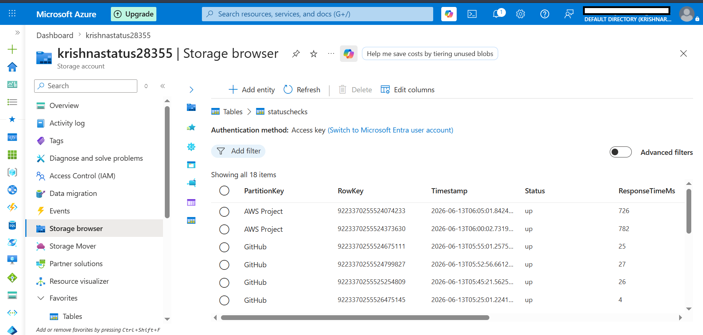
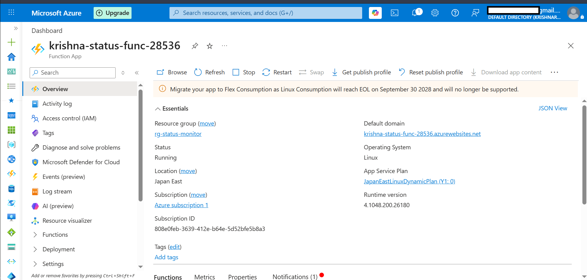
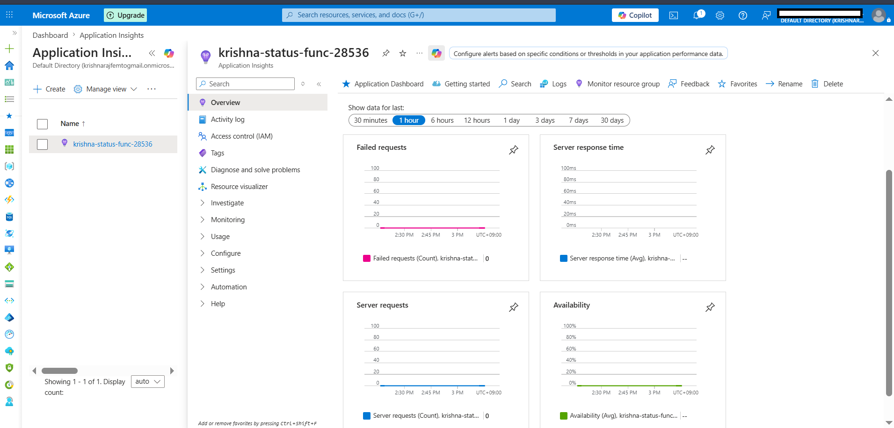

# Azure Status Monitor — ライブ稼働状況ページ

**言語:** [English](README.md) | [日本語](README.jp.md)

---

## 概要

いくつかのウェブサイトが正常に動いているかを5分ごとにチェックし、その結果をライブの状態ページに表示する、小さな監視ツールです。GitHubやSlackなどが公開している「ステータスページ」のような仕組みです。

これは2つ目のAzureプロジェクトで、前回とは違うトリガー(タイマー)とストレージ(Table Storage)を試すために作りました。

**ライブデモ:** https://krishnastatus28355.z11.web.core.windows.net/

## 仕組み



1. Azure Functions の `StatusCheck` が5分ごとに自動実行される
2. 登録されたサイトにアクセスし、応答があったか、応答時間、チェック時刻を記録する
3. 結果はそれぞれ Azure Table Storage に1行として保存される
4. 静的なWebページ(Azure Storageでホスティング)が、各サイトの直近10件の結果をTable Storageから直接取得し、緑/赤のドットで履歴を表示する

## 使用技術

- Java 17
- Azure Functions(タイマートリガー)
- Azure Table Storage
- Azure Storage 静的Webサイトホスティング
- Application Insights(自動で監視・ログが有効化される)
- リソース作成はAzure CLIで実施

## 作業の様子(スクリーンショット)

**ライブの状態ページ**


**Table Storageに保存された実データ**


**Function Appの概要**


**Application Insights(モニタリング)**


## 設計について

- ページはTable Storageから読み込んでいますが、読み取り専用かつテーブル限定のSASトークンを使っており、ストレージアカウントキー自体は公開していません
- 各チェックは、タイムスタンプを反転させた値をRowKeyとして保存しているため、最新のチェックが自然に先頭にソートされます
- スクリーンショットの中で1つのサイトが「down」と表示されているのは演出ではありません。URLを間違えていた時の実際の結果で、後で修正しました。監視が実際に問題を検出した例として、そのまま残しています。

## 実行方法

リソースの作成:

```bash
az group create --name rg-status-monitor --location japaneast

az storage account create --name <storage-name> \
  --resource-group rg-status-monitor --location japaneast --sku Standard_LRS --kind StorageV2

az storage blob service-properties update \
  --account-name <storage-name> --static-website \
  --index-document index.html --404-document index.html

az storage table create --name statuschecks --account-name <storage-name>
```

`local.settings.json.example` を `local.settings.json` にコピーして、ストレージの接続文字列を入力してください。

ローカル実行:
```bash
mvn clean package azure-functions:run
```

その後、`index.html` 内のストレージアカウント名と、読み取り専用・テーブル限定のSASトークンを自分のものに更新し、アップロードします:
```bash
az storage blob upload --account-name <storage-name> \
  --container-name '$web' --name index.html --file index.html --overwrite
```

## その他

- Azureの無料枠内で動作確認しました
- 現在、関数はCloud Shell上でローカル実行しています。常時稼働のクラウド関数としてデプロイすることは今後の改善点です

## 作成者

Krish — [GitHub](https://github.com/krishfemto)
